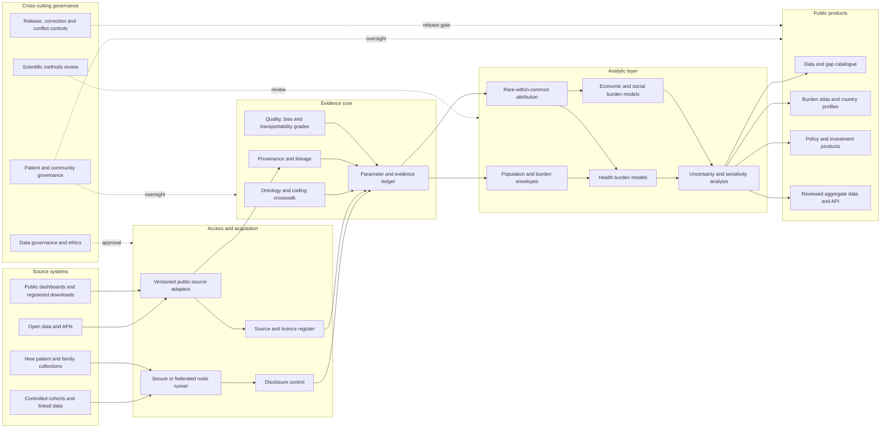
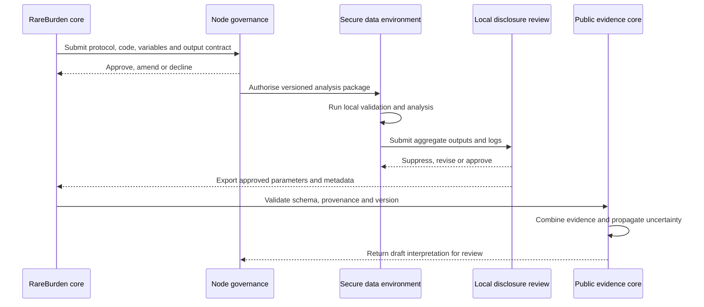
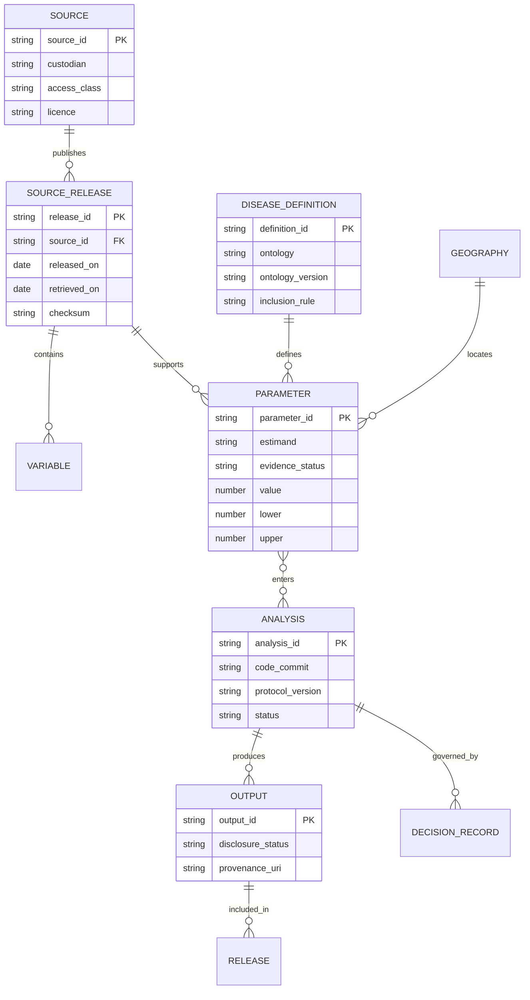

# System and data architecture

**Status:** Conceptual architecture v0.2; implementation staged through the v1 roadmap

## Architectural summary

RareBurden Commons separates public evidence, controlled analysis and released outputs. Public sources flow through versioned adapters into a provenance-rich evidence core. Controlled data never enter the public platform by default: a node runner executes approved analyses within the custodian environment and exports only disclosure-controlled parameters. The modelling layer combines these parameters with population and burden envelopes while preserving uncertainty and evidence status.

## Trust boundaries

1. **Public zone:** code, schemas, metadata, public aggregate inputs and approved outputs.
2. **Local working zone:** downloaded data permitted for local analysis but not necessarily redistribution.
3. **Controlled node zone:** participant-level data and sensitive outputs subject to custodian controls.
4. **Release boundary:** only reviewed, licensed and disclosure-safe aggregate artefacts cross into the public zone.

## Federated analysis sequence

The core team defines an estimand and portable package. A local node reviews it, executes it under local approvals, applies disclosure control and returns only approved metadata and summary parameters. The commons validates structure and combines the result with other evidence; it does not receive the underlying records.

## Core metadata model

The metadata model keeps sources, releases, variables, disease definitions, parameters, analyses and outputs distinct. This permits a parameter to be re-used or invalidated when a source or ontology version changes.

## Component responsibilities

### Source register

Discovery and access metadata only; it must not contain secrets. Each source records suitability, access route, terms, release cadence and known limitations.

### Ontology and coding service

Maintains versioned disease definitions, crosswalks and burden-purpose aggregation. It records one-to-many mappings and uncertainty rather than forcing false equivalence.

### Parameter ledger

Stores estimands and evidence, not merely values. Every parameter carries population, period, disease definition, source release, evidence status, uncertainty, bias and transportability metadata.

### Modelling engine

Combines parameters according to a registered analysis specification. Modules remain separate for expected affected population, rare-within-common attribution, health burden and economic/social burden.

### Node runner

A portable package containing code, environment specification, variable contract, tests and disclosure-output template. It should be executable without outbound internet where secure environments require it.

### Release service

Builds versioned aggregate releases, documentation and machine-readable manifests after scientific, governance and disclosure approval.

## Deployment evolution

### Foundation

Git repository, static documentation, YAML/JSON metadata, local validation and manually downloaded public sources.

### Public-data MVP

Automated adapters, Parquet/DuckDB evidence store, reproducible Quarto reports and archived releases.

### Federated network

Containerised or environment-portable node packages, signed manifests, schema-compatible outputs and a reviewed public aggregate API.

## Security and privacy controls

- secrets scanning and no credentials in Git;
- source-specific licence and permitted-use checks;
- controlled data analysed only in approved environments;
- local disclosure thresholds and inferential disclosure review;
- minimum necessary variables and outputs;
- immutable release manifests and audit logs;
- no public model output that permits reconstruction of prohibited small cells;
- incident, correction and withdrawal procedures before controlled nodes launch.

## V1 delivery controls

The component architecture is implemented through the release and track gates in `docs/roadmap-v1.md`. The separate delivery diagrams in `docs/design/v1-delivery-architecture.md` show track lifecycle, assurance and release evidence. A component is not treated as production-ready merely because it appears in this conceptual diagram.
