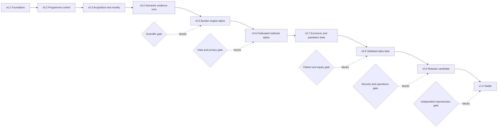
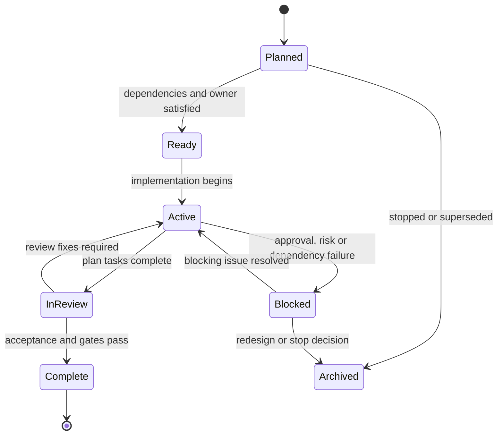
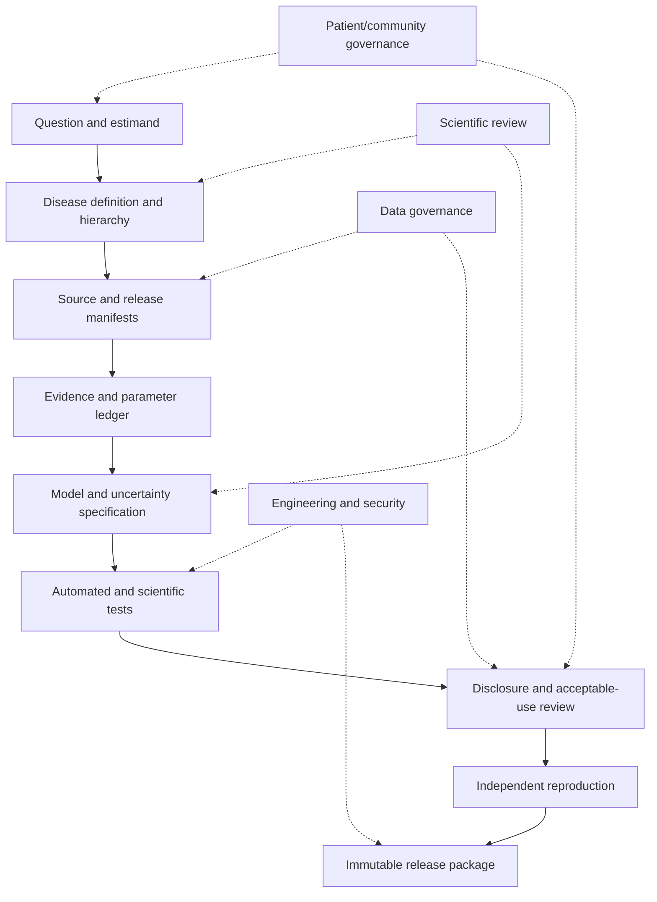
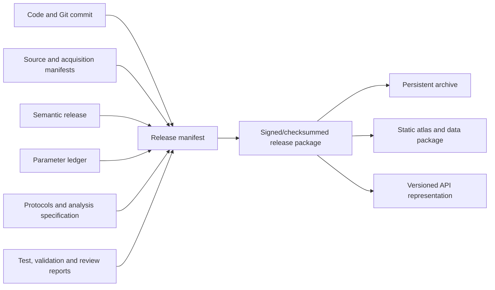

# V1 delivery architecture

## Release flow

The delivery system moves from programme definition to a stable supported release. Gates can narrow or stop a release; they are not ceremonial approvals.

The scientific product remains a versioned static release even when a hosted API or atlas is available. This preserves an immutable source of truth.

## Track lifecycle

A track cannot be Complete without a review record. A release cannot count incomplete tracks as evidence.

## Assurance pipeline

Each released estimate must trace backwards through this chain. A missing link is a release-blocking provenance defect.

## Release evidence package

The atlas and API are generated representations of the reviewed release package. They do not read directly from mutable working data.
